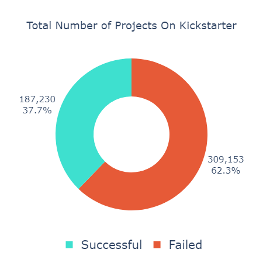
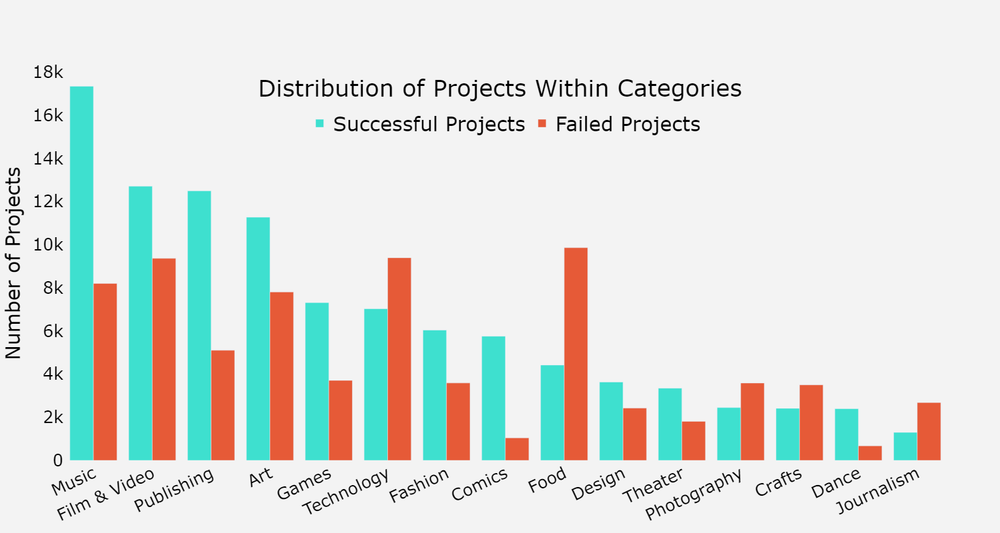
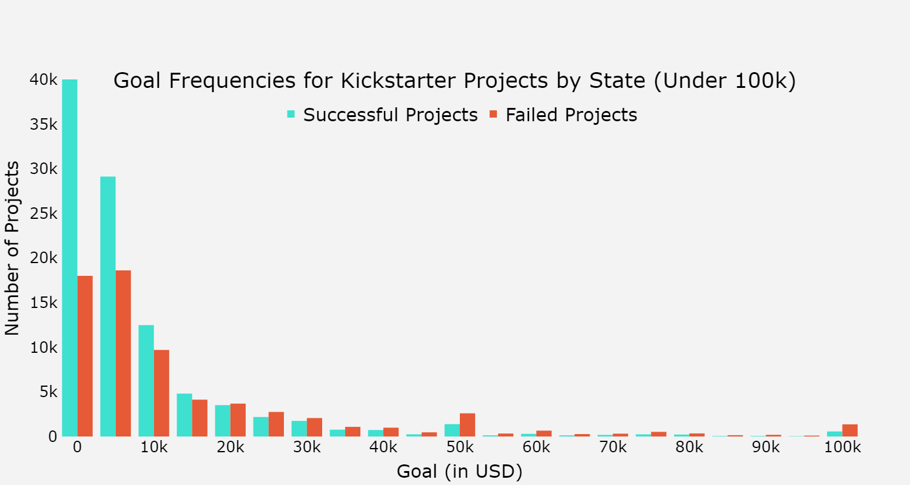
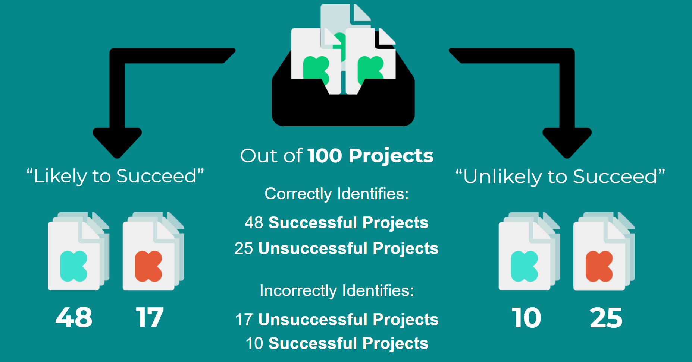

# Kickstart Informed
#### Create successful projects with machine learning

Project by Raven Welch | [LinkedIn](https://www.linkedin.com/) | [Email](mailto:ravennhwelch@gmail.com) | [Medium](https://medium.com/@ravenwelch)

---

### ReadMe Navigation
[Sources](#Sources) | [Overview](#overview) | [Limitations & Next Steps](#limitations--next-steps) | [Reproduction](#reproduction)

### Repo Navigation
```
├── data_processing: Contains detailed data processing and modeling files, as well as functions 
│   ├── data
│   ├── models
│   ├── src
│   ├── Cross_Validation.ipynb
│   ├── DataCleaningBook.ipynb
│   └── GridSearch_CLOUD.ipynb
│
├── viz: Contains vizualization resources and images
│   ├── Viz.ipynb
│   ├── Category_Distribution.png
│   ├── Data_dist.png
│   ├── KS_Goal_Freq.png
│   └── KS_Tot_Proj.png
│
├── Executive_Notebook.ipynb
│
├── README.md
│
└── Final_Presentation.pdf
```
---

## Sources

The data was collected by [webrobots.io](https://webrobots.io/kickstarter-datasets/) (2020-07-16), scraped from [Kickstarter](https://www.kickstarter.com/)

All icons used are created by [Font Awewsome Icons](https://fontawesome.com/license/free) and are under a CC license, and are modified by myself

The template used for the presentation was created by [Slides Carnival](https://www.slidescarnival.com/) and modified by myself

## Overview

### What is Kickstarter?

Kickstarter is a well-known crowdfunding platform created in 2009, with a focus on helping people fund new creations such as art, film, technology, and games of both the digital and physical variety.

The funding process is all-or-nothing, if you meet the goal you get the money to fund the project, but if you don't meet it, nothing is gained. Depending on the kind of project, it may mean that there is more risk involved if you need to fund a prototype or research. 

With that, there's also a question of when to start a project, how long should it be, what should the goal be? All is handled by the creator of the project, unless a third party source is aiding. 



### Adding in machine learning

Machine learning can be used to help give an edge to the project creator. With it, less time could be spent on research on certain details while more focus can be spent on the actual project itself. An individual person isn't going to be able to look at thousands of projects, however one can gather _data_ from thousands of projects and create a machine learning model that can predict if a project is more or less likely to succeed, given certain details.

### The Data

The data used for this project was collected by [webrobots.io](https://webrobots.io/kickstarter-datasets/), and I used the data from 172,740 projects. 

About 100,000 were marked as "Successful" and around 72,800 were marked as "Failed"


The features I used for training and testing the models were the following:
- Start & End Dates 
- Country & Currency
- Category
- Project Goal
- Staff Pick (Whether or not the project was featured by staff) 
- Blurb

When exploring the data, some things to note is the distribution of successful vs failed projects within categories. Some categories, like food and fashion, have a lowewr success rate compared to categories such as music, film & video, and publishing. However, one thing to note is that while comics has a very high success rate, this may be due to the fact that many comics already may have an active audicence. The same may be true for music as well. 



When investgating the frequency of success versus failure in projects in terms of their projct goals, projects with a goal of under $5k US dollars are about twice as likely to succeed, with the chance of success quickly lowering as a project increase in goal.



### Modeling

I initially tested 13 different models using cross validation, without tuning the hyperparameters, to evaluate which did better in terms of precision score. Precision was selected as the goal was to reduce the number of failed projects being misclassified as likely to succeed. 

After that, I selected the four best models and used Google Cloud to perform grid searches to tune the models until the grid search no longer changed in terms of what it gave as the "best parameters". The four models chosen were the following: AdaBoostClassifier, BaggingClassifier, RandomForestClassifier, and GradientBoostingClassifier. 

The final model I selected was the Gradient Boosting classifier, with an accuracy of 72.53% and a precision score of 0.73.



### Interpretation 

While the model is not perfect, the purpose is to _inform_ and supplement decisions made when going along the project process, not make a for-sure declaration of whether or not the project _will_ succeed.

For those who have their project declared as 'likely to succeed' by the model, they may be more confident with their project succeeding. If they have not already set the details such as the start date, length and goal, they can finalize those details with the features they inputted into the model. And then, they can begin advertising to help ensure their success!

However, for those who have their project declared as 'unlikely to succeed' by the model, they may want to do more research into their project to determine if there's anything that they should alter or do to heighten their chance of success. On top of that, they can alter the different details that they entered into the model to see if there is a better date, length, etc that may help.

As always, with the 73% accuracy the project creator must keep risk in mind as well.

## Limitations & Next Steps

### Limitations

Unfortunately, the model does not cover a variety of important factors.
- Objective factors such as text data, trends, images, and items of interest as well as similar kinds of data are not covered 

- Yearly trends are not recognized

- Data is only about ~34% of all Kickstarter projects 

- Data does not contain information such as stretch goals, number of tiers, early bird tiers, and more 

### Next Steps

The next steps to take, but not limited to, are the following: 

- Test creating models for each parent category, using sub-categories as a feature.

- Further refine models, and experimenting with using less features to increase accuracy.

- Test other algorithms, such as XGBoost, and research to see if there are others that may perform better

- Creating an algorithm to analyze blurb data and titles to see whether or not the words used may draw more attention, and therefore, more backers. 

## Reproduction

Run the [executive notebook](Executive_Notebook.ipynb) recreate the modeling process. However, this does not include items such as the [Google Cloud gridsearch]('data_processing/GridSearch_CLOUD.ipynb') as it is not fit to be run on a regular computer.

If you would like to review the data cleaning process, unzip [the raw CSVs]('data_processing/data/Kickstarter_CSVs.zip) if you have not already and run the [data cleaning notebook]('data_processing/DataCleaningBook.ipynb'). 
